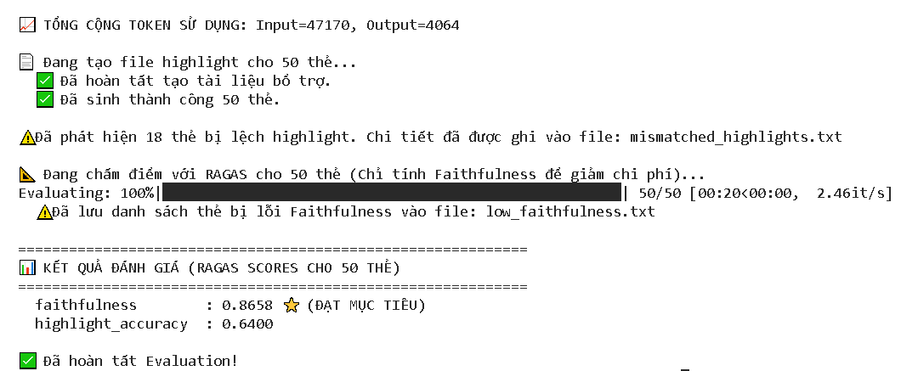
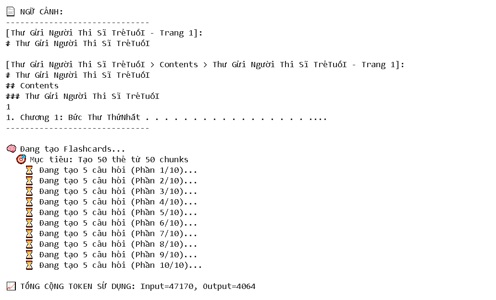

# Báo cáo Đánh giá Hệ thống RAG (Evaluation Evidence)

Tài liệu này cung cấp bằng chứng và kết quả đánh giá (Evaluation Evidence) cho hệ thống RAG_luc, dựa trên đợt chạy kiểm thử tự động (batch 50 cards).

## 1. Thông tin Phiên Đánh giá
- **Tài liệu kiểm thử**: `Thu_gui_nguoi_thi_si_tre_tuoi.pdf`
- **Kích thước kiểm thử**: Sinh 50 Flashcards
- **Số lượng chunk**: 86 chunks (xử lý bằng Hierarchical Clustering)
- **Mô hình Embedding**: `text-embedding-3-small` (OpenAI)
- **Framework Đánh giá**: RAGAS và Custom Script

## 2. Kết quả Metrics (Đo lường)

Dựa trên log kết quả thực tế từ `evaluator.py`:

| Metric | Điểm số | Đánh giá | Ghi chú |
|--------|---------|----------|---------|
| **Faithfulness** (Độ trung thực) | **0.8658** | ⭐ **ĐẠT MỤC TIÊU** | Điểm số > 0.8 cho thấy LLM bám sát nội dung PDF rất tốt, ít bị ảo giác (hallucination). |
| **Highlight Accuracy** (Độ chuẩn xác Highlight) | **0.6400** | ⚠️ CẦN CẢI THIỆN | Có 18/50 thẻ bị lệch highlight (ID chunk câu hỏi khác ID chunk câu trả lời). |

## 3. Chi phí & Hiệu suất
- **Input Tokens**: `47,170`
- **Output Tokens**: `4,064`
- **Thời gian Evaluate RAGAS**: ~20 giây cho 50 thẻ (tốc độ ~2.46 it/s).

## 4. Bộ log & Phản hồi (Feedback)

Hệ thống đã xuất ra các file log chi tiết để phục vụ debug và cải thiện:
1. **`mismatched_highlights.txt`**: Chứa chi tiết 18 thẻ bị lệch highlight. Cho thấy hệ thống RAG đôi khi trích xuất chunk trả lời không khớp hoàn toàn với vị trí của câu hỏi.
2. **`low_faithfulness.txt`**: Chứa danh sách các thẻ có điểm faithfulness < 0.8 để kiểm tra lỗi sinh text của LLM.

## 5. Hành động đề xuất (Next Steps)
- **Về Highlight**: Cần rà soát lại logic ánh xạ `id_cau_hoi` và `id_cau_tra_loi` trong quá trình prompt LLM sinh Flashcard. Có thể cần giới hạn lại ngữ cảnh (context) hoặc yêu cầu LLM trích xuất chính xác text từ chunk ban đầu.
- **Về Faithfulness**: Tiếp tục duy trì. Có thể phân tích thêm file `low_faithfulness.txt` để tinh chỉnh prompt nếu cần đạt điểm > 0.9.

## 6. Ảnh bằng chứng

> Toàn bộ kết quả nằm trong RAG_luc/monitoring folder


## 7. Prompt Engineering: Tối ưu hóa việc sinh flashcards

### Chiến lược sử dụng Prompt

Thay vì chỉ yêu cầu LLM tạo flashcards một lần (điều dễ gây ra lỗi đánh máy hoặc mất ngữ cảnh), chúng tôi đã áp dụng chiến lược:

1. **chia nhỏ (Chunking)**: Dữ liệu đầu vào được chia thành các phần nhỏ hơn.
2. **Sinh thẻ từng phần**: LLM được yêu cầu sinh flashcards cho từng phần riêng lẻ.
3. **Phản hồi từng phần**: Kết quả được thu thập từng bước, đảm bảo chất lượng ổn định.

### Kỹ thuật Prompt chính

Chúng tôi sử dụng một prompt kỹ thuật để hướng dẫn LLM:

```markdown
Bạn là một trợ lý giáo dục chuyên nghiệp, có khả năng tạo flashcards cực kỳ chính xác từ văn bản.
Tạo 5 flashcards tập trung vào kiến thức cốt lõi từ nội dung được cung cấp.

Các quy tắc:
- Mỗi thẻ phải có 1 câu hỏi và 1 câu trả lời. Chỉ trả lời duy nhất câu trả lời, không giải thích thêm.
- Đảm bảo câu trả lời chính xác tuyệt đối như trong văn bản, không bịa đặt (no hallucination).
- Với mỗi thẻ, hãy cung cấp thêm 3-5 thẻ phụ (follow-up questions) giúp đào sâu kiến thức liên quan.
- Chỉ dùng thông tin từ văn bản, KHÔNG được thêm thông tin từ nguồn bên ngoài.
```

### Phương pháp tối ưu

Thay vì sinh toàn bộ 50 thẻ một lần, chúng tôi chia nhỏ để đảm bảo từng thẻ được tạo ra chính xác, từ đó giảm lỗi nhận biết của LLM.

### Ảnh minh họa
